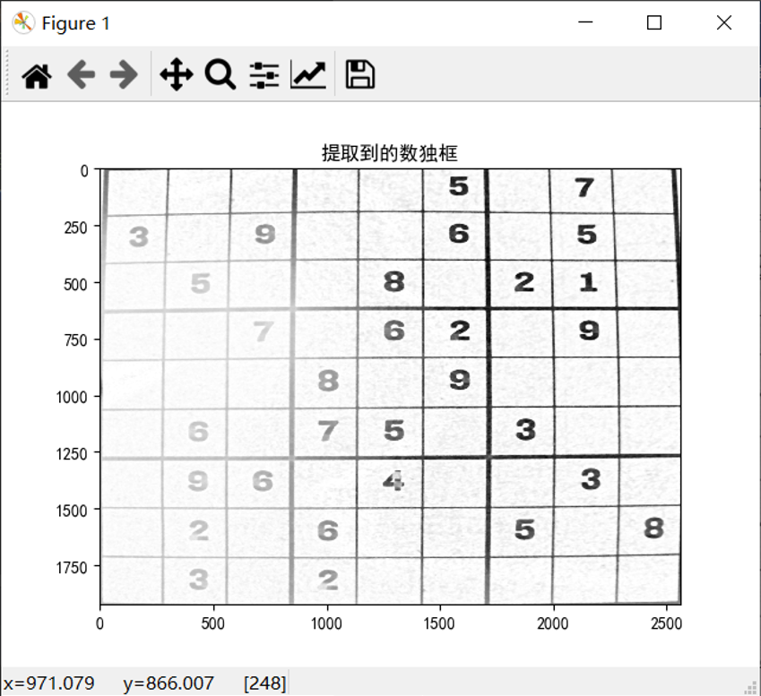

# 设计题目

基本要求：

- 从图像中找到表格，提取每个小格
- 识别小格中的数字，空白的用0表示
- 形成识别后的9×9矩阵


- 对图像进行适当的预处理（去掉阴影，提高对比度）提高图像的质量
- 提高数字的识别准确率
- 自动从变形的图像中找到数独表格，并变换到合适的角度
- 自动实现数独的求解


# 图像分割

　　首先对需要处理的图片进行分析，发现图像中的数独框角度、大小、清晰程度均有差异，因此对需要提取的数独框，采用手动提取和自动提取两种方案。对于自动提取效果差的图像，采取手动提取。

　　读入图像——变换图像大小——中值滤波消除椒盐噪声——将图片转换为灰度图——获取数独框顶点——对图像进行第一次正畸，若效果较好，则运行自动提取程序；若效果不理想，则采用手动选点方式进行纠正。

## 自动提取

### 预处理

　　由于边缘识别、中值滤波、高斯滤波等算法中的参数需要根据图像大小进行调整，因此我们首先对读入的图像做缩放，至2560×1920大小。

```python
# 选择读入的图像的编号
my_img_number = int(input('请输入1-24，读取相应编号的图像：\n'))
# 读入图像
original_img = cv2.imread('../images/sudokus/sudoku{}.jpg'.format(my_img_number))
# 变换图像为指定大小
original_img = cv2.resize(original_img, (2560, 1920))
```

　　由于彩色图像通道数为3，不利于后续处理，因此，将图像转换为灰度图像

```python
# 将图片数据类型转换为灰度图
gray_img = cv2.cvtColor(median_img, cv2.COLOR_RGB2GRAY)
```

　　对图像进行预处理，由于中值滤波对椒盐噪声有很好的去噪效果，且能够保留边缘，因此，我们对图像进行中值滤波。

```python
# 中值滤波器，消除椒盐噪声
median_img = cv2.medianBlur(original_img, 5)
```

　　对读入的图像进行观察，如果有明显阴影的话，则需要进行阴影去除，否则会对后续图像二值化的阈值确定、边缘识别产生影响。

### 阴影去除

　　对于**阴影去除**，由于阴影的颜色较有效图像的颜色较深，因此我们采取对图像执行一次最小滤波、一次最大滤波后，再归一化使用背景减法得到最终的去除阴影的图像。

　　*最大滤波：*对于有一定大小的图像`I`，逐个遍历I的像素，并且对于每个像素`(x，y)`，找到该像素周围的邻域（大小为`N×N`的窗口）中的最大灰度值，并进行写入A中相应像素位置`(x，y)`的最大灰度值。所得图像`A`称为输入图像`I`的最大滤波图像。

```python
# 最大滤波
    def max_filtering(N, I_temp):
        wall = np.full((I_temp.shape[0] + (N // 2) * 2, I_temp.shape[1] + (N // 2) * 2), -1)
        wall[(N // 2):wall.shape[0] - (N // 2), (N // 2):wall.shape[1] - (N // 2)] = I_temp.copy()
        temp = np.full((I_temp.shape[0] + (N // 2) * 2, I_temp.shape[1] + (N // 2) * 2), -1)
        for y in range(0, wall.shape[0]):
            for x in range(0, wall.shape[1]):
                if wall[y, x] != -1:
                    window = wall[y - (N // 2):y + (N // 2) + 1, x - (N // 2):x + (N // 2) + 1]
                    num = np.amax(window)
                    temp[y, x] = num
        A = temp[(N // 2):wall.shape[0] - (N // 2), (N // 2):wall.shape[1] - (N // 2)].copy()
        return A
```

　　*最小滤波：*对于有一定大小的图像`I`，逐个遍历I的像素，并且对于每个像素`(x，y)`，找到该像素周围的邻域（大小为`N×N`的窗口）中的最小灰度值，并进行写入B中相应像素位置`(x，y)`的最小灰度值。所得图像`B`称为输入图像`I`的最小滤波图像。

```python
# 最小滤波
    def min_filtering(N, A):
        wall_min = np.full((A.shape[0] + (N // 2) * 2, A.shape[1] + (N // 2) * 2), 300)
        wall_min[(N // 2):wall_min.shape[0] - (N // 2), (N // 2):wall_min.shape[1] - (N // 2)] = A.copy()
        temp_min = np.full((A.shape[0] + (N // 2) * 2, A.shape[1] + (N // 2) * 2), 300)
        for y in range(0, wall_min.shape[0]):
            for x in range(0, wall_min.shape[1]):
                if wall_min[y, x] != 300:
                    window_min = wall_min[y - (N // 2):y + (N // 2) + 1, x - (N // 2):x + (N // 2) + 1]
                    num_min = np.amin(window_min)
                    temp_min[y, x] = num_min
        B = temp_min[(N // 2):wall_min.shape[0] - (N // 2), (N // 2):wall_min.shape[1] - (N // 2)].copy()
        return B
```

　　*归一化的背景减法:*

```python
# 标准化
    def background_subtraction(I, B):
        O = I - B
        norm_img = cv2.normalize(O, None, 0, 255, norm_type=cv2.NORM_MINMAX)
        return norm_img
```

### 图像正畸

　　对图像进行**第一次正畸**，由于后续算法中，我们采用Sobel算子对图像X方向、Y方向的边缘分别进行提取，于是需要首先将图像摆正。我们采用边缘识别，认定其中最小外接四边形面积最大的边缘为数独框，获取到此最小外接四边形的4个顶点后，采用仿射变换，对图像进行第一次正畸

```python
def min_square_contour(img):
    """
    提取出数独框所在的最小外接四边形，对图像进行第一次正畸
    :param img: 获取图像
    :return: affine_trans_img: 仿射变换后的图像
    """
    # 提取图像边缘
    edges = cv2.Canny(img, 20, 100, apertureSize=3)
    # 腐蚀
    kernel = cv2.getStructuringElement(cv2.MORPH_RECT, (15, 15))  # 腐蚀矩阵
    corrosion_img = cv2.morphologyEx(edges, cv2.MORPH_DILATE, kernel)  # 腐蚀运算
    img_contour, contours, hierarchy = cv2.findContours(corrosion_img, cv2.RETR_TREE, cv2.CHAIN_APPROX_SIMPLE)
    # 创建显示最小四边形的容器
    img_tmp = np.ones(img.shape, dtype=np.uint8)
    # 创建最小外接四边形顶点的容器
    boxes = []
    # 获取每个轮廓的最小外接四边形
    for c in contours:
        # 找面积最小的矩形
        rect = cv2.minAreaRect(c)
        # 得到最小矩形的坐标
        tmp_box = cv2.boxPoints(rect)
        # 标准化坐标到整数
        tmp_box = np.int0(tmp_box)
        boxes.append(tmp_box)
    # 根据轮廓面积从大到小排序
    boxes = sorted(boxes, key=cv2.contourArea, reverse=True)
    # 获取面积最大的最小外界四边形（认为此为数独框轮廓的最小外接四边形）
    cv2.drawContours(img_tmp, [boxes[0]], 0, (255, 255, 255), 10)
    print('最小外接四边形的顶点为：\n', boxes[0])
    print('如果输出的图像不正确，请首先确保顶点顺序依次应为左下角、左上角、右上角、右下角，否则需要对此函数获取仿射变换变换矩阵的部分进行修改！')
    # 下面进行仿射变换，进行对图像的第一次正畸
    # 获取原图的宽高
    h, w = img.shape[:2]
    dst = np.array([[0, h], [0, 0], [w, 0]], np.float32)
    src = np.array([boxes[0][0], boxes[0][1], boxes[0][2]], np.float32)
    # 获取变换矩阵
    trans = cv2.getAffineTransform(src, dst)
    # 仿射变换
    affine_trans_img = cv2.warpAffine(img, trans, (w, h))
    figure()
    title('数独框的第一次正畸')
    imshow(affine_trans_img, 'gray')
    print('关闭所有图像窗口后程序继续运行')
    show()
    return affine_trans_img
```

### 自动分割

　　对视角变换后的图像，进行第一次检查，如果效果好，则继续进行下一步的数独框提取操作，否则进行手动提取

　　对得到的图像进行边缘检测，并得到最大矩形轮廓，认定此轮廓为数独框轮廓，采用`Sobel`算子分别对`x`方向、`y`方向进行边缘提取并对提取出的边缘做闭操作，增强边缘。再对得到的`x`方向、`y`方向的边缘取与的位运算，就能够得到数独框的4个角点，再次对这4个角点做轮廓检测，就能够得到这4个角点的位置坐标。再利用透射变换就能够得到数独框。

```python
def get_points_autoly(img):
    """
    自动获取数独框的4个顶点
    :param img: 输入图像
    :return: points: 得到的数独框4个顶点
    """
    # 统计概率霍夫直线变换
    def line_detect_possible_demo(image):
        lines = cv2.HoughLinesP(image, 1, np.pi / 180, threshold=100, minLineLength=0, maxLineGap=100)
        # 创建保存霍夫变换直线检测结果的容器
        hough_img = np.ones(image.shape, dtype=np.uint8)
        for line in lines:
            x1, y1, x2, y2 = line[0]
            cv2.line(hough_img, (x1, y1), (x2, y2), (255, 255, 255), 10)
        # 进行概率霍夫直线检测
        ret, hough_img = cv2.threshold(hough_img, 127, 255, cv2.THRESH_BINARY)
        return hough_img
    # 边缘检测
    edges = cv2.Canny(img, 10, 60, apertureSize=3)
    # 腐蚀
    kernel = cv2.getStructuringElement(cv2.MORPH_RECT, (30, 30))  # 腐蚀矩阵
    corrosion_img = cv2.morphologyEx(edges, cv2.MORPH_DILATE, kernel)  # 腐蚀运算
    # 轮廓检测
    img_contour, contours, hierarchy = cv2.findContours(corrosion_img, cv2.RETR_EXTERNAL, cv2.CHAIN_APPROX_SIMPLE)
    # 得到最大矩形轮廓
    max_area = 0
    biggest_contour = None
    for cnt in contours:
        area = cv2.contourArea(cnt)
        if area > max_area:
            max_area = area
            biggest_contour = cnt
    # 创建最大矩形轮廓的容器
    tmp_img = np.ones(img.shape, dtype=np.uint8)
    # 画出最大矩形轮廓
    tmp_img = cv2.drawContours(tmp_img, [biggest_contour], 0, (255, 255, 255), 30)
    # tmp_img = cv2.cvtColor(tmp_img, cv2.COLOR_RGB2GRAY)

    # 通过Sobel算子提取x方向的边缘，并做直线检测后做闭操作
    dx = cv2.Sobel(tmp_img, cv2.CV_16S, 1, 0)
    dx = cv2.convertScaleAbs(dx)
    cv2.normalize(dx, dx, 0, 255, cv2.NORM_MINMAX)
    ret, close = cv2.threshold(dx, 0, 255, cv2.THRESH_BINARY + cv2.THRESH_OTSU)
    kernelx = cv2.getStructuringElement(cv2.MORPH_RECT, (2, 10))
    close = cv2.morphologyEx(close, cv2.MORPH_DILATE, kernelx, iterations=1)
    binary, contour, hierarchy = cv2.findContours(close, cv2.RETR_EXTERNAL, cv2.CHAIN_APPROX_SIMPLE)
    for cnt in contour:
        x, y, w, h = cv2.boundingRect(cnt)
        if h / w > 5:
            cv2.drawContours(close, [cnt], 0, 255, -1)
        else:
            cv2.drawContours(close, [cnt], 0, 0, -1)

    close = cv2.morphologyEx(close, cv2.MORPH_CLOSE, None, iterations=1)
    closex = close.copy()
    line_closex = line_detect_possible_demo(closex)
    kernel = cv2.getStructuringElement(cv2.MORPH_RECT, (40, 40))  # 腐蚀矩阵
    fushi_line_closex = cv2.morphologyEx(line_closex, cv2.MORPH_DILATE, kernel)  # 腐蚀运算

    # 通过Sobel算子提取y方向的边缘，并做直线检测后做闭操作
    dy = cv2.Sobel(tmp_img, cv2.CV_16S, 0, 1)
    dy = cv2.convertScaleAbs(dy)
    cv2.normalize(dy, dy, 0, 255, cv2.NORM_MINMAX)
    ret, close = cv2.threshold(dy, 0, 255, cv2.THRESH_BINARY + cv2.THRESH_OTSU)
    kernely = cv2.getStructuringElement(cv2.MORPH_RECT, (10, 2))
    close = cv2.morphologyEx(close, cv2.MORPH_DILATE, kernely, iterations=1)
    binary, contour, hierarchy = cv2.findContours(close, cv2.RETR_EXTERNAL, cv2.CHAIN_APPROX_SIMPLE)
    for cnt in contour:
        x, y, w, h = cv2.boundingRect(cnt)
        if w / h > 5:
            cv2.drawContours(close, [cnt], 0, 255, -1)
        else:
            cv2.drawContours(close, [cnt], 0, 0, -1)

    close = cv2.morphologyEx(close, cv2.MORPH_CLOSE, None, iterations=1)
    closey = close.copy()
    line_closey = line_detect_possible_demo(closey)
    kernel = cv2.getStructuringElement(cv2.MORPH_RECT, (100, 60))  # 腐蚀矩阵
    fushi_line_closey = cv2.morphologyEx(line_closey, cv2.MORPH_DILATE, kernel)  # 对腐蚀运算
    # 得到数独框的4个顶点
    res = cv2.bitwise_and(fushi_line_closex, fushi_line_closey)
    # 轮廓检测
    binary, contour, hierarchy = cv2.findContours(res, cv2.RETR_LIST, cv2.CHAIN_APPROX_SIMPLE)
    centroids = []
    for cnt in contour:
        if cv2.contourArea(cnt) > 20:
            mom = cv2.moments(cnt)
            (x, y) = int(mom['m10'] / mom['m00']), int(mom['m01'] / mom['m00'])
            centroids.append((x, y))
    centroids = np.array(centroids, dtype=np.float32)
    c = centroids.reshape((4, 2))
    c2 = c[np.argsort(c[:, 1])]
    # 得到角点
    b = np.vstack([c2[i * 10:(i + 1) * 10][np.argsort(c2[i * 10:(i + 1) * 10, 0])] for i in range(10)])
    bm = b.reshape((2, 2, 2))
    return bm


def perspective_trans(img, src_points):
    """
    透视变换
    :param img: 需要透视变换的图像
    :param src_points: 数独框顶点
    :return: perspective_trans_img: 透视变换后的图像
    """
    h, w = img.shape[:2]
    dst = np.array([[0, h], [0, 0], [w, 0], [w, h]], np.float32)
    src = np.array([src_points[0][0], src_points[0][1], src_points[1][0], src_points[1][1]], np.float32)
    # 得到透视变换的矩阵
    trans = cv2.getPerspectiveTransform(src, dst)
    perspective_trans_img = cv2.warpPerspective(img, trans, (w, h))
    return perspective_trans_img
```

　　再次对所得图像进行判断，如果得到数独框图像，就继续下一步的图像分割，否则采用手动提取

　　对于图像分割，由于图像中数独框没有较大的弯曲现象，因此我们直接等份数独框即可.

```python
def img_splite(img, img_number):
    """
    将数独图像分割为81个36*36的小图像
    :param img:
    :param img_number:
    :return: None
    """
    print('正在进行图像分割，请等待...')
    h, w = img.shape[:2]
    h_slice = int(h / 9)
    w_slice = int(w / 9)
    for i in range(0, 9):
        for j in range(0, 9):
            # 要被切割的开始的像素的高度值
            beH = h_slice * i
            # 要被切割的结束的像素的高度值
            hEnd = h_slice * (i + 1)
            # 要被切割的开始的像素的宽度值
            beW = w_slice * j
            # 要被切割的结束的像素的宽度值
            wLen = w_slice * (j + 1)
            dst_img = img[beH:hEnd, beW:wLen]
            # 存储图像
            dst_img = cv2.resize(dst_img, (36, 36))
            cv2.imwrite("../images/sudokus/sudoku{}/{}_{}.png".format(img_number, i + 1, j + 1), dst_img)
            # 提示运行结束
    print('已保存分割图像至文件夹sudoku{}，请至相应查验'.format(img_number))
```

　　如果没有建立保存分割图像的文件夹，则需要首先运行下列代码，建立对应文件夹

```python
# 创建24个文件夹，分别用以装24个数独图像的分割图
file_path=os.path.abspath(r"../images/sudokus")
for i in range(1,25):
    a="sudoku{}".format(i)
    file_name=file_path + "\\"+a
    os.makedirs(file_name)
```

### 效果





## 手动提取

　　对于手动提取，我们需要手动获取数独框的4个角点，然后进行一次透射变换即可。图像的预处理和后续图像分割操作和自动提取相同。

```python
def get_points_manually(img):
    """
    手动获取数独框的4个顶点
    :param img: 输入图像
    :return: points: 得到的数独框4个顶点
    """
    # 改变这个参数调整对应点的对数
    point_pair = 4
    # 显示图像
    figure()
    title('选取数独框')
    imshow(img, 'gray')
    # 取点
    print('请点击{}个数独框顶点，依次应为左下角、左上角、右上角、右下角，请尽量准确选取'.format(point_pair))
    # 创建点的容器
    points = []
    for i in range(point_pair):
        x = ginput(1)
        print('第{}个:'.format(i + 1), x)
        points.append(x)
    return points

def perspective_trans(img, src_points):
    """
    透视变换
    :param img: 需要透视变换的图像
    :param src_points: 数独框顶点
    :return: perspective_trans_img: 透视变换后的图像
    """
    h, w = img.shape[:2]
    dst = np.array([[0, h], [0, 0], [w, 0], [w, h]], np.float32)
    # 对于实物，未检测出来的图像采取手动取点
    src = np.array([src_points[0], src_points[1], src_points[2], src_points[3]], np.float32)
    # 得到透视变换的矩阵
    trans = cv2.getPerspectiveTransform(src, dst)
    perspective_trans_img = cv2.warpPerspective(img, trans, (w, h))
    return perspective_trans_img
```

### 效果


# 图像识别

## 图像预处理

　　原始数据集中的图像具有以下明显的特点：图像存在深浅不一的黑边，背景深度不同，图像对比度相差较大。这些特点会影响CNN网络对于图像特征的提取，容易导致过拟合或欠拟合现象的发生，因此，我们采用如下方法进行图像预处理。

- 将图像缩放到36×36大小，删除图像边缘的四个像素，进行图像黑边的滤除；

- 将图像二值化，背景为黑色，数字为白色，对图像进行归一化，消除背景深度和对比度对CNN网络的影响。

```python
img = cv2.imread(imname,cv2.IMREAD_GRAYSCALE)
# 去除黑边
img = cv2.resize(img,(36,36))
img = img[4:-4,4:-4]
# 参考minst数据集，进行二值处理并黑白反转
ret, img = cv2.threshold(img,100,255,cv2.THRESH_BINARY_INV)
```

## 图像增强

　　由于数据集图像较少，使用数据增强可以增加数据集容量，优化模型鲁棒性。我们对图像进行随机旋转，水平平移，数值平移，错切变换，放大等操作，将一张原始图像变换得到5张新图像。使得训练集容量破1w张。

　　我们使用`keras`深度学习工具包对图像的数据增强部分进行具体实现，引入`keras.preprocessing.image.ImageDataGenerator`并完成参数定义，具体代码如下。

```python
datagen = ImageDataGenerator(
    rotation_range = 5,             # 随机旋转度数
    width_shift_range = 0.1,    	# 随机水平平移
    height_shift_range = 0.1,   	# 随机竖直平移
    shear_range = 5,            	# 随机错切变换
    zoom_range = 0.1,           	# 随机放大
    fill_mode = 'nearest',      	# 填充方式
) 
```

## `CNN`网络

　　使用卷积神经网络对数据集进行训练，定义如下网络结构。


　　第一层网络为卷积层，使用`32`个`5×5`的卷积核对特征进行初步提取，使用`same padding`的方式保证边缘效果，利用relu函数进行激活。

　　第二层为池化层，`2×2`池化，步长为`2`，池化方法为平均池化。

　　第三层为卷积层，使用`64`个`5×5`的卷积核对特征进行进一步提取，此时，卷积核的感受野大于第一层网络的卷积，对特征可以进行更深层次的提取。和第一层网络一样，使用`same padding`的方式保证边缘效果，利用`relu`函数进行激活。

　　第四层为池化层，和第二层作用一样。

　　第五层为`Flatten`，将池化结果resize到一维向量。

　　第六层为全连接，将CNN的结果进行初步提炼。

　　第七层为`dropout`，训练时随机中断一些神经元的连接，这种方法可以有效的防止模型过拟合，提高鲁棒性。

　　第八层为全连接层，利用`softmax`激活函数输出`one-ho`t编码结果。

　　在训练过程中，利用`adam`优化器进行训练，利用`categorical_crossentropy`作为loss function。

## 模型训练

　　定义`batch_size=64`，对数据集进行10次训练，得到在训练集上准确性`99.82%`，在测试集上准确性`100%`。有效的提高了预测精度。


对第一个数独进行识别，有如下结果


# 数独求解

　　通过回溯算法进行求解，具体思路如下：

1. 求出每个数字为0的位置可以填的数，并将其位置和能填的数分别以key和value的方式存储到字典里面；

2. 将字典里的数据按照所能填写的数据的多少进行排序，先在能填的数少的里面选取一个进行填写

3. 将填写的过程记录到列表里面，这个地方暂时想到的就是用列表记录填写过程

4. 更新1、2步，若出现某一步可填写的数据为空，说明之前某一步的选择有问题，回溯回去，更换数值，然后回到步骤1

5. 当所有的数都填完后，退出循环

　　当图像识别不准的时候，会引起数独无法求解，故对求解过程进行超时判断，当求解时间超过2s时，抛出异常。

```python
eventlet.monkey_patch()  # 必须加这条代码
try:
    with eventlet.Timeout(2, True):  # 设置超时时间为2秒
        ans = sodoku_solver.solve(suduko)
        print(ans)
except eventlet.timeout.Timeout:
    print('数独无解')
```

　　以第一个数独为例，有如下求解结果。

